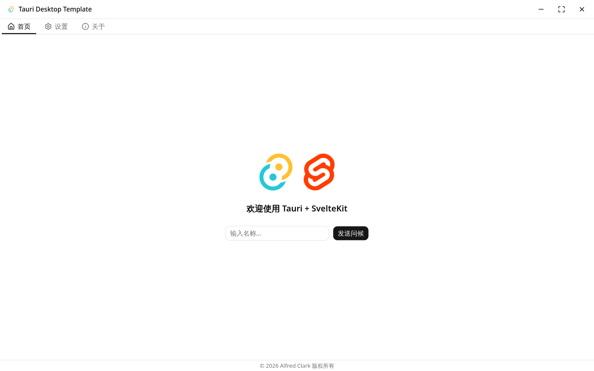
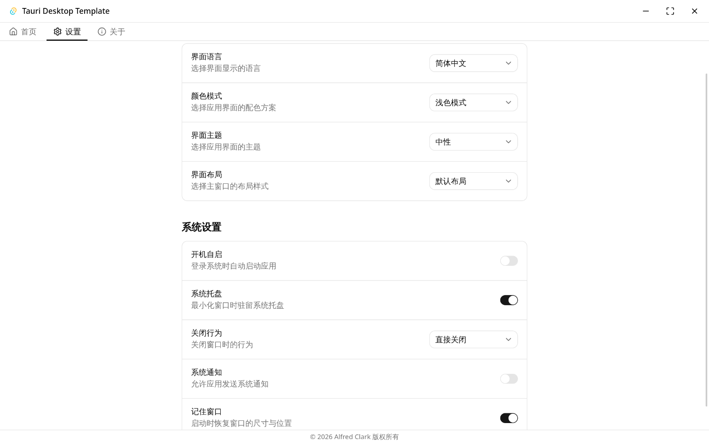
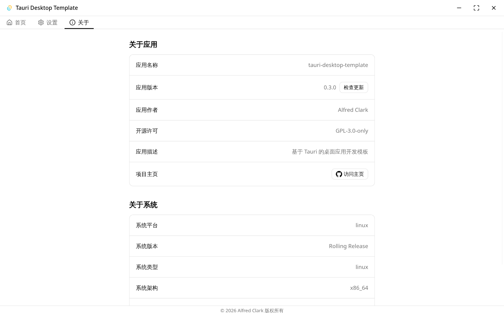

# tauri-desktop-template

[English](../README.md) · 简体中文

基于 Tauri 2 的桌面应用开发模板，前端使用 SvelteKit 5 + TypeScript，后端使用 Rust。
已集成系统托盘、全局快捷键、开机自启、单实例、自动更新、对话框、文件系统、系统信息、
剪贴板、通知、窗口状态记忆等桌面应用常见能力，可作为新桌面应用项目的起点。

## 截图

|           首页           |             设置             |           关于            |
| :----------------------: | :--------------------------: | :-----------------------: |
|  |  |  |

## 技术栈

- **前端**：SvelteKit 5 / Svelte 5 / TypeScript / Vite / Tailwind CSS v4 / shadcn-svelte（包管理器 bun）
- **后端**：Tauri 2 / Rust（edition 2024）
- **国际化**：Paraglide（前端）/ rust-i18n（后端）
- **质量工具**：ESLint / Stylelint / Prettier / Clippy / rustfmt / Husky + lint-staged

## 插件

- **系统级**：tray-icon 系统托盘、autostart 开机自启、global-shortcut 全局快捷键、single-instance 单实例、window-state 窗口状态记忆、menu 应用菜单（仅 macOS）
- **桌面能力**：updater 自动更新、notification 通知、dialog 对话框、fs 文件系统、os 系统信息、clipboard-manager 剪贴板、opener 打开外部程序、process 进程控制、system-fonts 系统字体、log 日志、store 配置持久化

## 开发规范

完整的开发规范（架构分层、代码风格、校验约定、Git 流程等）见 [AGENTS.md](../AGENTS.md)。

## 快速开始

```bash
bun install
bun run i18n:compile  # paraglide 编译产物不入库，安装依赖后需先编译
bun run tauri:dev     # 开发模式
bun run tauri:build   # 生产构建
```

## 模板初始化

发布自有应用前请先完成身份重命名（identifier / productName / updater 公钥与 endpoints）
并移除演示模块——详见 [AGENTS.md](../AGENTS.md)。

## 许可

[GPL-3.0-only](../LICENSE)
